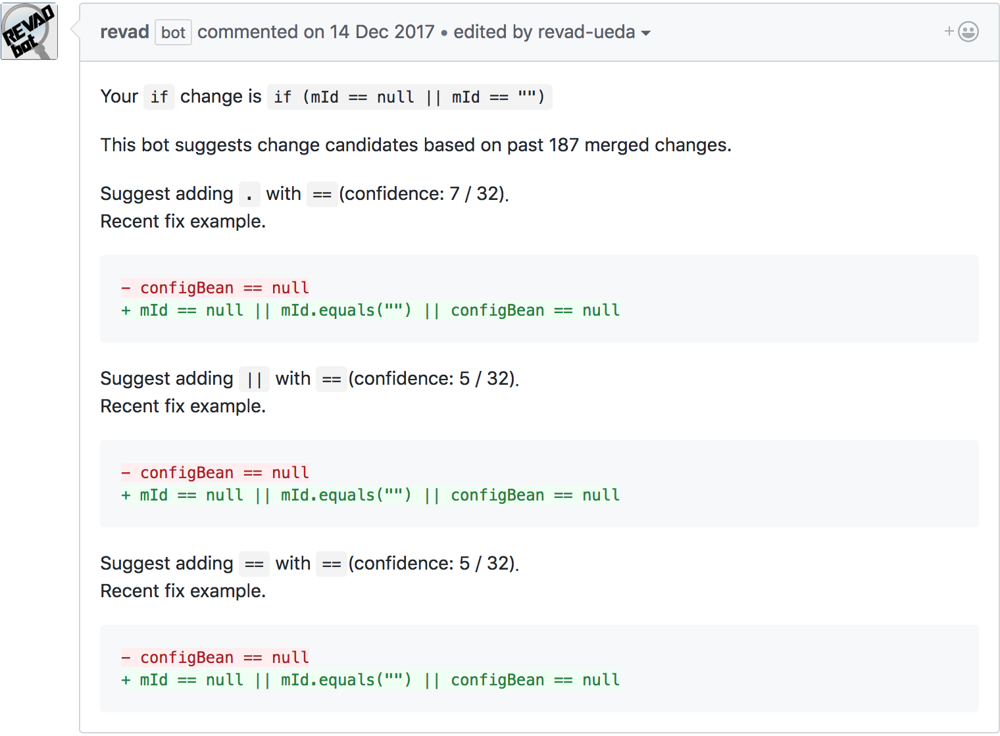

# REVAD bot IF

## Usage

* Need Node(>= 7.7.0), npm(>= 4.0.0), git
* Please see CONTRIBUTING.md

## More detail about REVAD

<https://drive.google.com/file/d/1dKPWw8OoRJNlTpZA13Vb-v48qnk1DNrg/view>

## Function

* Reply comment to the IF statement change pull request
